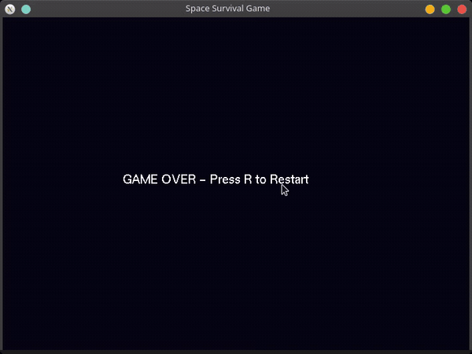
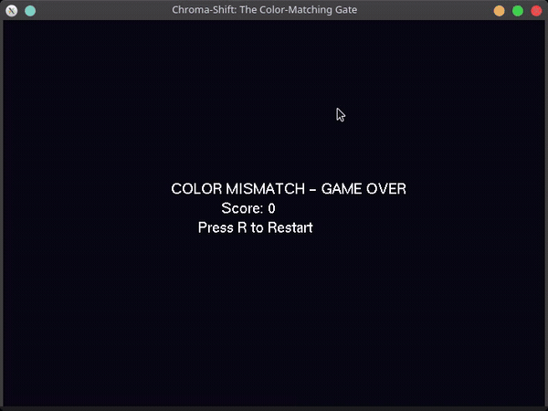
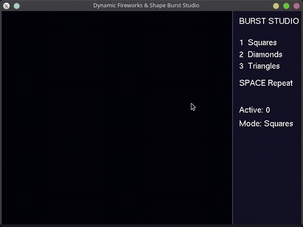

# CS0045 Module 3 Exercise 2

LIAM BRENT SERRANO

TN35

Interactive OpenGL and GLUT machine problems for CS0045 Computer Graphics and Visual Computing.

## Machine Problem 1 — The Cosmic Dodger

Space-survival game with ship controls, falling asteroids, score tracking, lives, collisions, and restart support.

Source: [m1.cpp](m1.cpp)

## Machine Problem 2 — Chroma Shift The Color Matching Gate

Color-matching game with a moving barrier, player color controls, score updates, and game-over handling for a mismatch.

Source: [m2.cpp](m2.cpp)

## Machine Problem 3 — Dynamic Fireworks and Shape Burst Studio

Interactive burst studio featuring square, diamond, and triangle patterns with timer-driven animation and multiple active bursts.

Source: [m3.cpp](m3.cpp)

## Documentation

The completed laboratory manual will be available as `m3hjtopengl_completed.pdf` after upload.
